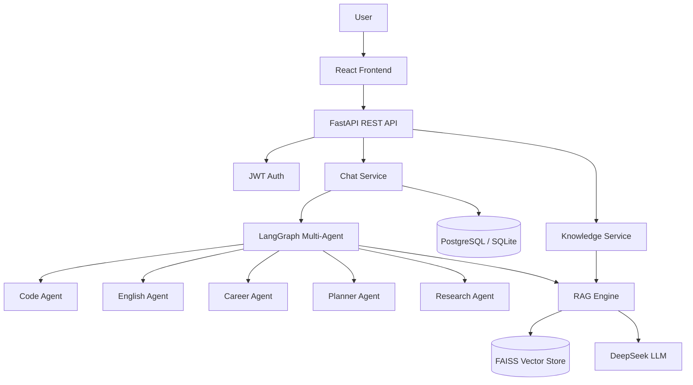

# AI Learning Assistant

<p align="center">
  
</p>

<p align="center">
  
  
  
  
  
  
  
</p>

## Overview

AI Learning Assistant is a multi-agent conversational learning platform powered by LangGraph and DeepSeek LLM. It provides personalized tutoring across programming, English learning, career planning, and research.

### Target Users
- **Students**: Get AI-powered personalized learning plans
- **Developers**: Reference for FastAPI + React + LangGraph architecture
- **Recruiters**: Demo of production-grade full-stack AI application

---

## Features

| Feature | Description |
|---------|-------------|
|  Multi-Agent Chat | Code, English, Career, Research, Planner agents |
|  RAG Knowledge Base | Upload PDFs, ask questions with source citations |
|  Conversation Isolation | Each session has its own knowledge base scope |
|  JWT Auth | Email/password registration and login |
|  Session History | Persistent conversation history with rename |
|  Real-time Streaming | Typing indicators and smooth message delivery |
|  Production Ready | Docker, Railway, PostgreSQL (Neon) support |

---

## Tech Stack

```
Frontend                     Backend                    AI / Infra
┌─────────────┐            ┌──────────────┐           ┌─────────────┐
│   React 19  │            │   FastAPI    │           │  LangGraph  │
│  TypeScript │  REST API  │  SQLAlchemy  │  RAG/LLM  │   DeepSeek  │
│    Vite     │◄──────────►│    JWT Auth  │◄─────────►│   FAISS     │
│ TailwindCSS │            │  PostgreSQL  │           │ Sentence-T  │
└─────────────┘            └──────────────┘           └─────────────┘
```

---

## Screenshots

| Login | Chat | Knowledge |
|-------|------|-----------|
|  |  |  |
| **Plans** | **Profile** | **API Docs** |
|  |  |  |

---

## Quick Start

### Prerequisites
- Python 3.11+
- Node.js 18+
- (Optional) Docker

### Backend

```bash
cd web_app/backend
python -m venv .venv && .venv\Scripts\activate
pip install -r requirements.txt
cp .env.example .env   # Edit API keys
uvicorn app.main:app --reload --port 8000
```

### Frontend

```bash
cd web_app/frontend
npm install
npm run dev
```

Open http://localhost:5173 in your browser.

### Docker (Alternative)

```bash
docker compose up --build
```

---

## Testing

```bash
# Backend tests
cd web_app/backend
pytest

# Frontend build check
cd web_app/frontend
npm run build
```

---

## Deployment

### Railway (Backend)

```bash
railway login
railway init
railway up

# Set environment variables:
#   DATABASE_URL=postgresql://...
#   DEEPSEEK_API_KEY=sk-...
#   SECRET_KEY=<random-string>
#   DEBUG=false
```

### Vercel (Frontend)

```
Import web_app/frontend/ to Vercel
Set VITE_API_URL=https://your-app.railway.app
```

---

## Project Structure

```
web_app/
├── backend/
│   ├── app/               # FastAPI application
│   │   ├── api/v1/        # REST endpoints
│   │   ├── models/        # SQLAlchemy models
│   │   └── services/      # Business logic + RAG
│   ├── alembic/           # Database migrations
│   └── Dockerfile
├── frontend/
│   ├── src/
│   │   ├── components/    # React components
│   │   ├── pages/         # Page views
│   │   ├── api/           # API client
│   │   └── types/         # TypeScript types
│   └── package.json
└── supervisor_agent/      # LangGraph agent definitions
```

---

## Architecture



---

## License

MIT
