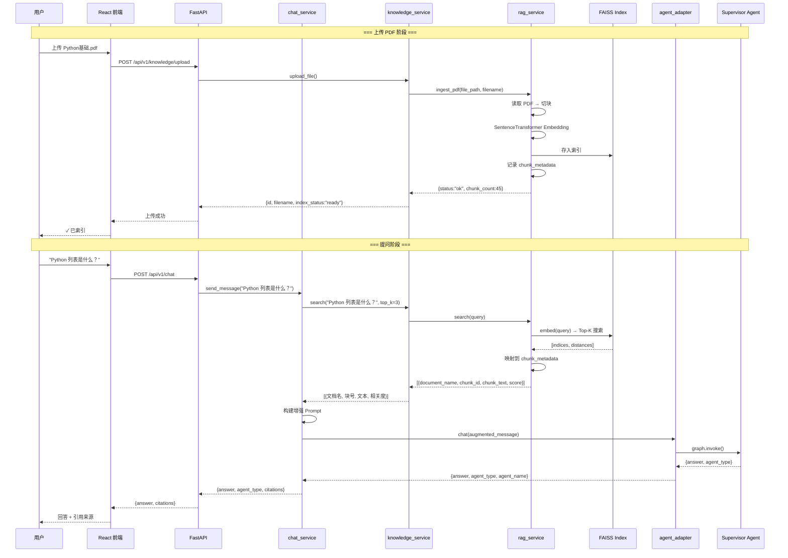
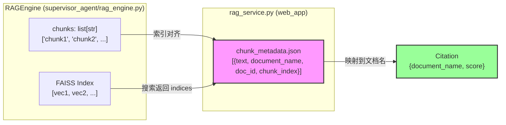
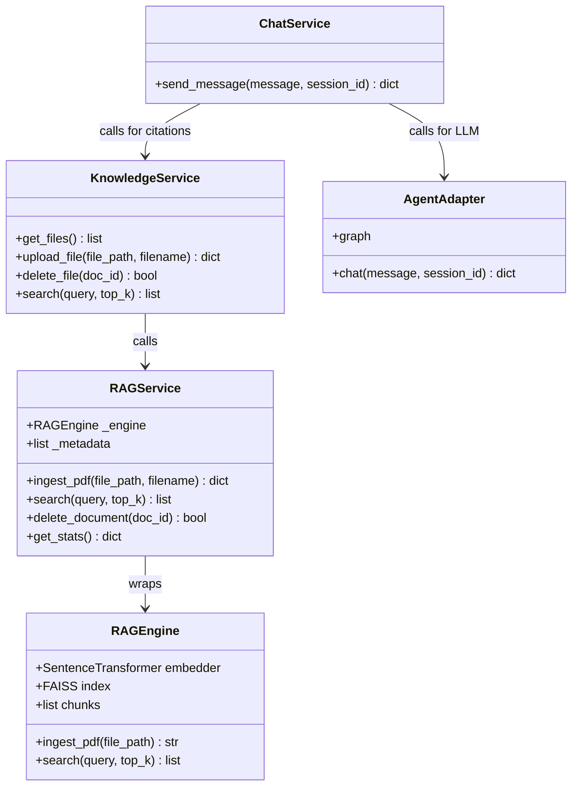
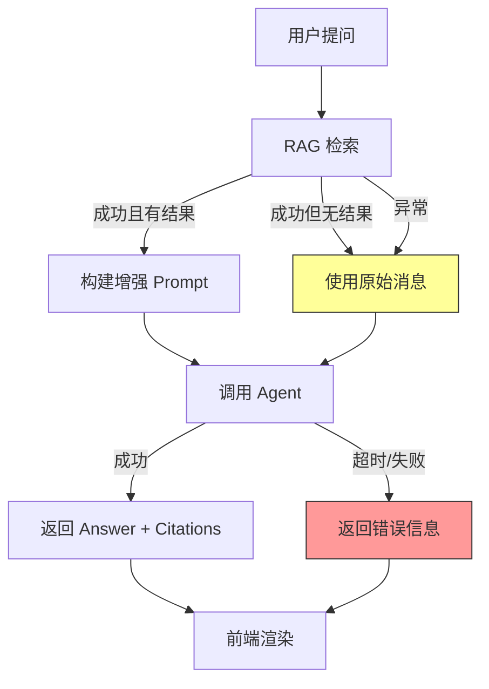

# AI Learning Assistant — 架构文档

> 系统架构图、数据流、状态流、Memory 流

---

## 1. 整体架构图

```mermaid
graph TB
    subgraph Frontend["Frontend (React + Vite :5173)"]
        CHAT["/chat 聊天页"]
        KNOW["/knowledge 知识库页"]
    end

    subgraph Backend["Backend (FastAPI :8000)"]
        API["API 路由层<br/>chat.py / knowledge.py"]
        CS["chat_service.py<br/>对话服务 + RAG 注入"]
        KS["knowledge_service.py<br/>文档管理 + 检索入口"]
        RS["rag_service.py<br/>FAISS 检索 + 元数据管理"]
        AA["agent_adapter.py<br/>桥接层"]
    end

    subgraph Agent["supervisor_agent/ (LangGraph)"]
        SV["Supervisor<br/>问题分类路由"]
        CA["Code Agent<br/>Python 编程"]
        EA["English Agent<br/>英语学习"]
        CR["Career Agent<br/>学习规划"]
        SA["Search Agent<br/>联网搜索"]
        RA["Research Agent<br/>多源研究"]
        RAG["RAG Agent<br/>文档问答"]
        PL["Planner<br/>任务拆解"]
        MEM["MemorySaver<br/>会话记忆"]
        LTM["user_profile.json<br/>长期记忆"]
    end

    subgraph Storage["数据存储"]
        FAISS[("FAISS 向量索引<br/>rag_index/")]
        META[("chunk_metadata.json<br/>块级元数据")]
        DOCS[("documents.json<br/>文档记录")]
        UPLOADS[("uploads/<br/>PDF 文件")]
    end

    %% 前端 → 后端
    CHAT -->|POST /api/v1/chat| API
    KNOW -->|POST/GET/DELETE /api/v1/knowledge| API

    %% 后端内部
    API --> CS
    API --> KS
    CS --> KS
    CS --> AA
    KS --> RS
    RS --> FAISS
    RS --> META
    KS --> DOCS
    KS --> UPLOADS

    %% 后端 → Agent
    AA -->|graph.invoke()| SV
    SV --> CA
    SV --> EA
    SV --> CR
    SV --> SA
    SV --> RA
    SV --> RAG
    SV --> PL
    CA --> MEM
    EA --> MEM
    CR --> MEM
    SA --> MEM
    RA --> MEM
    RAG --> MEM
    PL --> MEM
    CA --> LTM
    EA --> LTM
    CR --> LTM
    SA --> LTM
    RA --> LTM
    RAG --> LTM
    PL --> LTM
```

---

## 2. RAG 数据流



---

## 3. Chunk Metadata 架构



---

## 4. Memory 架构

```mermaid
graph TB
    subgraph SessionMemory["会话记忆 (MemorySaver)"]
        THREAD1["thread_id: session-abc<br/>消息历史"]
        THREAD2["thread_id: session-xyz<br/>消息历史"]
    end

    subgraph LongTermMemory["长期记忆 (user_profile.json)"]
        PROFILE["{<br/>  background: '计算机大一',<br/>  skill_level: 'beginner',<br/>  learning_goal: 'Python',<br/>  last_active: '2026-06-11',<br/>  conversation_count: 5<br/>}"]
    end

    subgraph KnowledgeMemory["知识记忆 (chunk_metadata.json)"]
        CMETA["[{<br/>  text: '...',<br/>  document_name: 'Python基础.pdf',<br/>  doc_id: 'uuid',<br/>  chunk_index: 0<br/>}]"]
    end

    Agent["Supervisor"] --> SessionMemory
    Agent --> LongTermMemory
    LongTermMemory -->|read_profile / update_profile tools| Agent
    KnowledgeMemory -->|search()| RAGService
    RAGService --> chat_service

    style SessionMemory fill:#eef,stroke:#333
    style LongTermMemory fill:#efe,stroke:#333
    style KnowledgeMemory fill:#ffe,stroke:#333
```

---

## 5. Component 关系图



---

## 6. 异常处理流程


