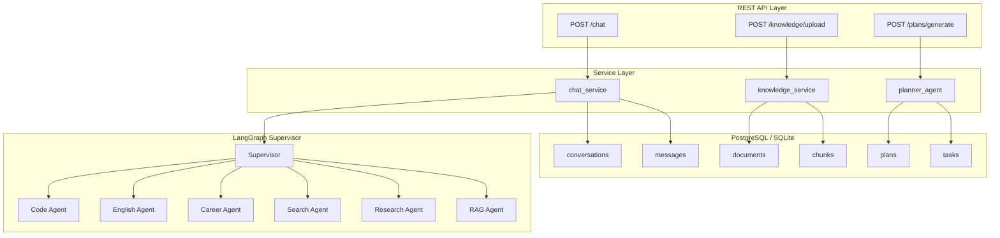

# AI Learning Assistant API 文档

> Base URL: `http://localhost:8000/api/v1`

---

## 1. 聊天 API

### POST /chat

发送消息给 AI 学习助手。

**Request Body：**

```json
{
  "message": "Python 列表是什么？",
  "session_id": "session-abc123"
}
```

| 字段 | 类型 | 必填 | 说明 |
|------|------|------|------|
| message | string | 是 | 用户消息，1~10000 字符 |
| session_id | string | 否 | 会话 ID，相同 ID 共享对话历史 |

**Response (200)：**

```json
{
  "answer": "Python 列表（list）是一种可变的有序集合...",
  "agent_type": "rag",
  "agent_name": "RAG Agent",
  "citations": [
    {
      "document_name": "Python基础教程.pdf",
      "chunk_id": 15,
      "chunk_text": "列表是 Python 中最常用的数据结构之一...",
      "relevance_score": 0.9215
    }
  ]
}
```

| 字段 | 类型 | 说明 |
|------|------|------|
| answer | string | AI 回答 |
| agent_type | string | Agent 类型：code/english/career/search/research/rag/planner |
| agent_name | string | Agent 显示名称 |
| citations | array | 引用来源列表（无知识库时为空） |

**CitationItem：**

| 字段 | 类型 | 说明 |
|------|------|------|
| document_name | string | 来源文档的文件名 |
| chunk_id | int | 文本块在索引中的编号 |
| chunk_text | string | 匹配到的文本块内容（前 500 字） |
| relevance_score | float | 语义相似度得分，0~1 之间 |

**cURL 示例：**

```bash
curl -X POST http://localhost:8000/api/v1/chat \
  -H "Content-Type: application/json" \
  -d '{"message":"Python 列表的常用方法","session_id":"test-1"}'
```

---

## 2. 知识库 API

### POST /knowledge/upload

上传 PDF 文件并自动建索引。

**Request：** multipart/form-data

| 字段 | 类型 | 必填 | 说明 |
|------|------|------|------|
| file | File | 是 | PDF 文件，最大 50MB |

**Response (200)：**

```json
{
  "id": "uuid-xxxx",
  "filename": "Python基础教程.pdf",
  "file_size": 1024000,
  "index_status": "ready",
  "chunk_count": 45,
  "page_count": 120,
  "created_at": "2026-06-11T10:00:00"
}
```

### GET /knowledge/files

获取已上传文件列表。

### DELETE /knowledge/{file_id}

删除指定文档及其索引。

---

## 3. 学习计划 API

### POST /plans/generate

生成 AI 学习计划。

**Request Body：**

```json
{
  "goal": "在8周内学会 FastAPI",
  "duration_weeks": 8,
  "user_id": null
}
```

| 字段 | 类型 | 必填 | 默认 | 说明 |
|------|------|------|------|------|
| goal | string | 是 | - | 学习目标，2~500 字符 |
| duration_weeks | int | 否 | 8 | 计划周数，1~52 |
| user_id | string | 否 | null | 用户 ID |

**Response (200)：**

```json
{
  "id": "1566ce18-xxxx-xxxx-xxxxxxxxxxxx",
  "title": "8周学会FastAPI：从入门到实战部署",
  "goal": "在8周内学会 FastAPI",
  "duration_weeks": 8,
  "weeks": [
    {
      "week": 1,
      "topic": "FastAPI基础与环境搭建",
      "description": "学习 FastAPI 框架的基本概念，搭建开发环境",
      "tasks": [
        {
          "order": 1,
          "description": "安装Python 3.8+，配置虚拟环境",
          "agent_type": "code"
        },
        {
          "order": 2,
          "description": "使用pip安装FastAPI和uvicorn",
          "agent_type": "code"
        }
      ]
    }
  ],
  "created_at": "2026-06-11T10:00:00"
}
```

**内部流程：**

```
POST /plans/generate
  → planner_agent.generate_plan()
    → LLM (DeepSeek): 分析目标 + 拆解知识点
    → LLM 返回: JSON {title, weeks: [{week, topic, description, tasks}]}
    → DB: INSERT into plans 表
    → DB: INSERT into tasks 表（批量，35~56 条）
    → Return: 结构化 JSON 响应
```

### GET /plans

获取学习计划列表。

**Response (200)：**

```json
[
  {
    "id": "1566ce18-xxxx",
    "title": "8周学会FastAPI：从入门到实战部署",
    "goal": "在8周内学会 FastAPI",
    "status": "active",
    "task_count": 35,
    "created_at": "2026-06-11T10:00:00"
  }
]
```

### GET /plans/{plan_id}

获取计划详情（含所有周任务和 Task 状态）。

### PATCH /plans/tasks/{task_id}

更新任务状态。

**Request Body：**

```json
{
  "status": "in_progress"
}
```

| 字段 | 类型 | 必填 | 说明 |
|------|------|------|------|
| status | string | 是 | pending / in_progress / completed / failed |

**Response (200)：**

```json
{
  "message": "updated",
  "task_id": "9e5340bc-xxxx",
  "status": "in_progress"
}
```

---

## 4. 系统 API

### GET /health

健康检查。

```json
{"status": "ok", "version": "0.2.0"}
```

## 5. Agent 类型

| agent_type | agent_name | 职责 |
|------------|------------|------|
| code | Code Agent | Python 编程问题 |
| english | English Agent | 英语学习问题 |
| career | Career Agent | 学习规划问题 |
| search | Search Agent | 联网搜索实时信息 |
| research | Research Agent | 多源深入研究 |
| rag | RAG Agent | 知识库文档问答 |
| planner | Planner | 复杂任务拆解执行 |

---

## 6. Agent 协作架构



---

## 7. 错误响应

```json
{
  "detail": "错误描述"
}
```

| HTTP 状态码 | 说明 |
|-------------|------|
| 400 | 请求参数错误 |
| 404 | 资源不存在 |
| 422 | 请求体验证失败 / LLM 生成异常 |
| 500 | 服务器内部错误 |
